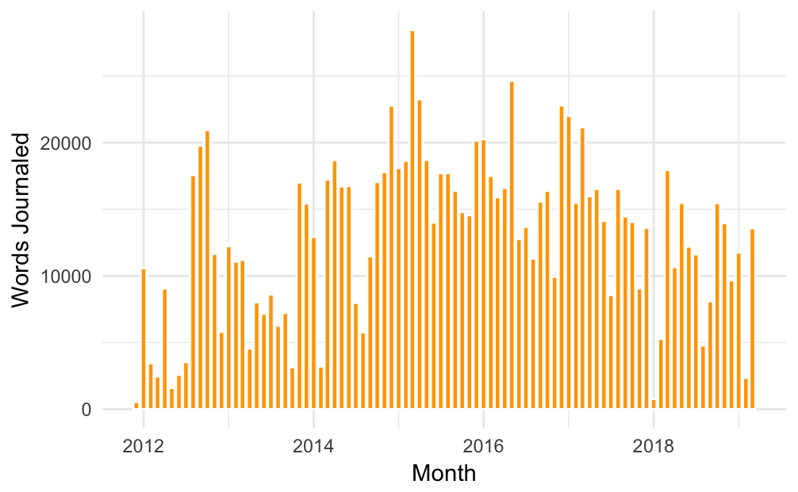
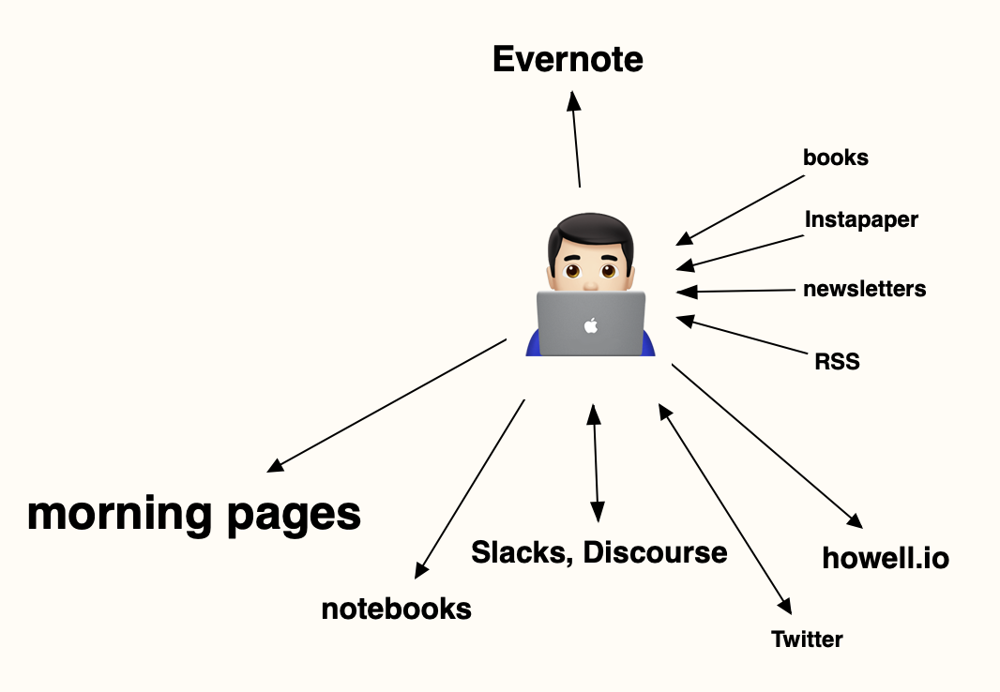

I am in the beginning stages of a cold, before the onset of the worst congestion. Although I'm not looking forward to what's to come, I find that the downward slope into an illness often comes with a somewhat enjoyable pattern of attention. I get drawn into things easily and can focus for long periods effortlessly. What a perfect time to hastily kick off a new project!

Journaling damn near every morning since late 2011 has yielded, at most recent count, over 1.1 _million_ words.

Morning journaling is how I get my brain in motion. I use it to work through dilemmas in my life without getting stuck in useless ruminative loops. Much of what I write is private, but some interesting ideas and connections also emerge. I aim to get better at extracting _those_ ideas and developing them further. That's what this newsletter is going to be for — practice at transmuting inchoate morning ramblings into something more.

I'm inspired in part by watching how [@visankanv thinks out loud on Twitter](https://twitter.com/visakanv) and [something he said in his Patreon overview](https://www.patreon.com/visakanv/overview). This rushed up my spine and rung my brain like a bell:

> And I don't care if Patreon doesn't work out, or if my book sales are underwhelming, whatever the outcome is. I love books, I love words, and I'm committed to spending the rest of my life writing feverishly until I die.
>
> Libraries, books, artists and storytellers saved me, made my life worth living. Everything I'm doing in life, honestly, is just scaffolding to allow me to return the favor and pass it on.

I'm probably never going to make a _living_ by writing, but at this point I can look at my folder of date-stamped text files and my stacks of notebooks and trust that I'm _not_ going to stop. I struggle with resistance to putting my writing in the public, though, so I made a diagram of the flow of sources I read and places I write to illuminate what's missing.

What I see is that the bulk of my writing goes into Evernote and my morning pages. Those are great for setting up feedback loops with my own thinking, but I also imagine words flowing into them like water into a quiet and stagnant pool. It's time to open new flows and connect that pool into a bigger ecosystem.

Pushing thoughts into spaces where are other people can _theoretically_ see them is qualitatively different then keeping them private. So even if no one ever subscribes, even if I am simply shouting into the void… that's just fine. Knowing you might be out there is enough to imbue the publish button with sufficient and useful danger.
