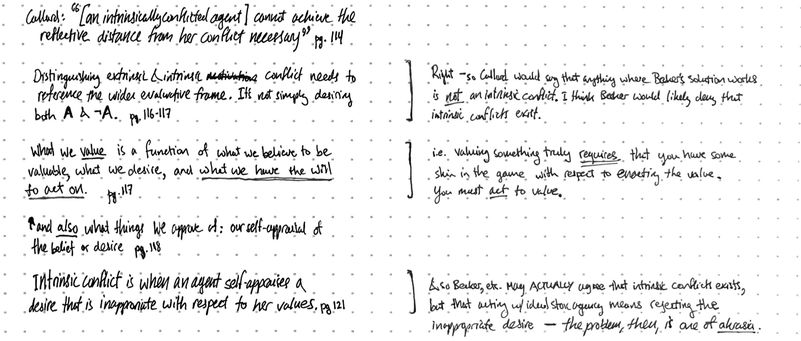

I recently finished Agnes Callard's [_Aspiration_](https://www.amazon.com/Aspiration-Agency-Becoming-Agnes-Callard-ebook/dp/B079Z98B7J/), in which she examines the kind of practical reasoning we do in service of acquiring new values.

> The aspirant's idea of the goodness of her end is characterized by a distinctive kind of vagueness, one she experiences as defective and in need of remedy. She is not satisfied with her own conception of the end and does not feel that arriving at the correct conception is simply a matter of waiting. She understands her aspirational activity as work she is doing toward grasping this end.

Callard applies the lens of aspiration to understand _akrasia_, the phenomena of agents acting against their own better judgement. When we make plans, we do so using our aspirations (the those values we'd like to have) and exclude the values we currently hold (but want to move past.)

> When we want to eat the cookie irrespective of what we will have to pay later on, the thought-content of that feeling is that only this pleasure matters. We do not believe that only this pleasure matters—the source of our deliberative activity outright rejects that thought, as part and parcel of its rejection of that feeling. This is what a subordinate evaluative perspective looks like: it is not a place from which to deliberate or reason about what to do, but it is nonetheless a place from which reasons for action spring.

The contention between aspiration and impulse can't be resolved by rational consideration, because they represent mutually contradictory frames of reference. Instead, internal conflict tends (at least for me) to show up as bodily tension pushing me away from a deliberative frame of mind.

Over the last few years, I've used the quantified self tool [Beeminder](https://www.beeminder.com/) to manage my own akrasia. I pay a financial penalty to Beeminder if I fail to keep up with my goals. The threat of loss aversion is a good cheat to get me through internal conflict on the side of my long-term goals. The Beeminder founders lean towards behavioral economics to understand akratic behavior, but I think Agnes Callard's view fits my experience better. When Beeminder is successful for me, it serves as scaffolding to help me remodel my in-the-moment decision making to align better with my aspirational, deliberative frame.

Using external tools to shape our behavior can seem inauthentic, which Leah Libresco addresses in [her post on using Beeminder to build spiritual habits]([https://blog.beeminder.com/rituals/]):

> spiritual life is a process of growth, which means it tends to include a lot of awkward stages. I've found it useful to "cheat" a number of ways in my prayer life, from seeking out opportunities to pray in community (where I feel more natural and less self-conscious) to praying while walking on my commute (the one reliable fixed point in my schedule).

I've also found [Beeminder helpful for building my meditation practice](https://blog.beeminder.com/meditation/)—and true to the aspirational model, the closer I get to apprehending the value of my practice, the less Beeminder is necessary to get me on the cushion.

Agnes Callard is a good writer and delightfully pugnacious. I'll leave you with her recent defense of adverserial discourse [in _The Point_](https://thepointmag.com/2019/examined-life/is-philosophy-fight-club-agnes-callard):

> We want to come to terms with the potential we have in us, a potential that will be left forever unknown until it's tested in the most extreme terms against the best opponent possible. That is a problem to which fighting is quite an efficient and rational solution. The only real way to know how hard I can fight is to fight as hard as I can.
