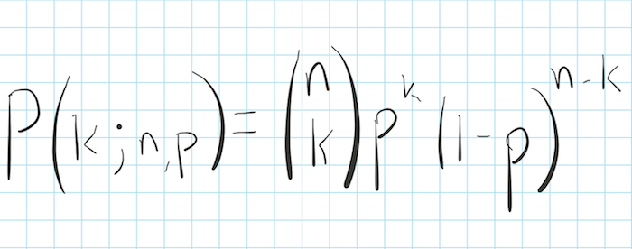
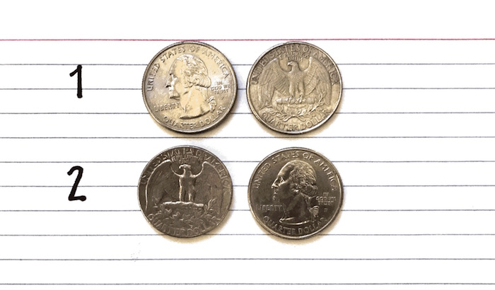
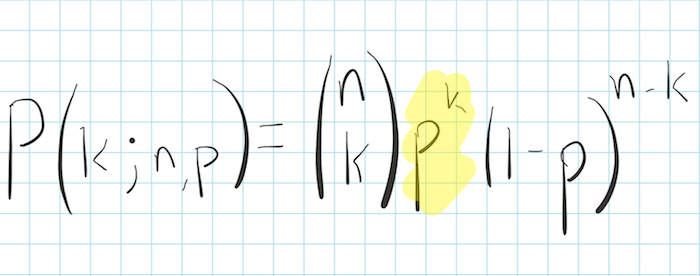
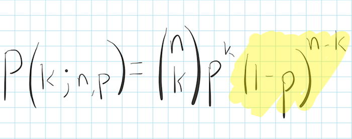
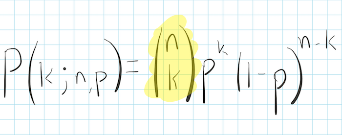

This is the binomial distribution, which represents the probability that you will have _k_ successes out of _n_ trials, when the probability of a successful trial is _p_.

To get concrete, if you want to know how likely it is that you'll get five heads if you flip a coin ten times[^1], then the binomial distribution is your pal. How do I know that? Because after reading a bunch about statistics, I've ultimately ended up with some kind of hazy flow chart in my head, lining up which distribution to pick to model different situations. A lot of distributions are special cases of each other, though -- John D. Cook has a handy diagram [showing the relationships][1]. But still, probability and statistics can feel kind of like birding: _I'll know a Cauchy distribution when I see it because it has stripes like_ _**this**_ _on its tail_.

I remember things better when I know how to build them from scratch. If I didn't know anything other the basic mechanics of probability, I'd start by calculating the probabilities for the simplest cases. The probability of getting heads after one coin flip is 50%. For the sake of getting to the more general form of the binomial distribution later, call that p.

What about getting heads once in two flips? Well, the chances of getting heads on the first flip are _p_. Then, the second flip has to be tails. Because probabilities have to add up to one, the probability of tails is _1 - p_. I multiply those together to get the _conditional probability_ of both events happening. But wait! Heads could have come first and tails second.

So I have to multiply out the chances of _that_ sequence and add those up.

I'd work out an example for three flips, but I'm all out of quarters. Anyway, I can see where this is going. We're multiplying the probability of different outcomes together and then adding up all the different ways the outcomes can be arranged. Any time there are _k_ successes, you have to multiply by _p_ that many times.

If there were _n_ trials (flips) total, the other _n - k_ must have been failures. So we need that many factors of _1 - p_.

Those heads could have come in any order, so we have to add up the probability for all [_n choose k_][2][^2] arrangements.

And that's the binomial distribution. I like stepping back to work through the fundamentals from time to time -- it's a good reminder that the most technical and obscure topics are still built from the ground up from small steps that make sense.

[^1]: About 25%, computed in R with `dbinom(5, 10, 0.5)`.

[^2]: Yeah, I'm hand-waving past the hard part.

[1]: http://www.johndcook.com/blog/distribution_chart/
[2]: https://en.wikipedia.org/wiki/Binomial_coefficient
